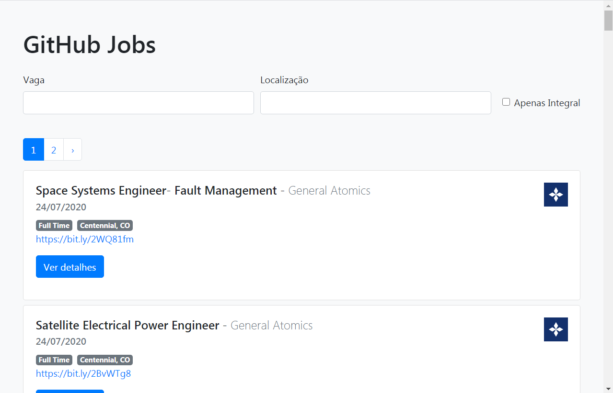

# GitHub Jobs

Aplicação de busca de emprego feita em ReactJS utilizando o axios para buscar os dados na api do GitHub Jobs.

## Tencnologias utilizadas

- [ReactJS](https://pt-br.reactjs.org/)
- [Axios](https://www.npmjs.com/package/axios)
- [React Bootstrap](https://react-bootstrap.github.io/)

## Rodando na sua máquina

Certifique-se de ter o Git e o Node.js instalado, se não tiver clique [aqui](#links)

Para testar a aplicação na sua máquina primeiro clone o repositorio:

~~~shell
git clone https://github.com/DaniloLima122/github-jobs-reactjs
~~~

Em seguida navegue até o diretorio que você acabou de clonar e instale as dependências do projeto:

~~~shell
npm install
~~~

Abra o projeto no seu editor de preferência e para ver ele rodando no seu navegador digite o seguinte comando no seu terminal:

~~~shell
npm start
~~~

E pronto!! Seguindo esses passos a pagina do projeto será aberta no endereço https://localhost do seu navegador para você ver o projeto funcionando.

## Contribuição

Este é um projeto de estudo do ReactJS mas toda contribuição é bem vinda, fique a vontade para abrir uma issue ou um pull request e também sugerir alguma mudança ou fazer alguma crítica.

## Links

Link para instalação do Git e/ou do Node caso você não tenha na sua máquina:

- [Node.js](https://nodejs.org/en/download/)
- [Git](https://git-scm.com/downloads)